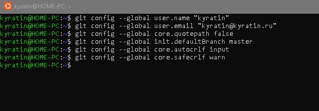
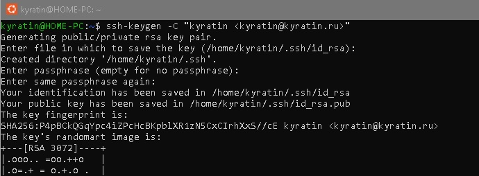
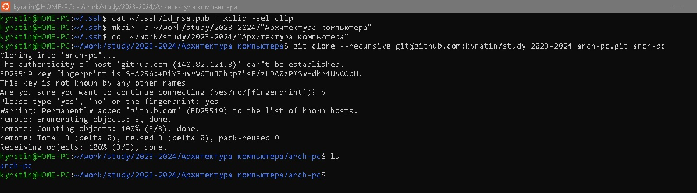
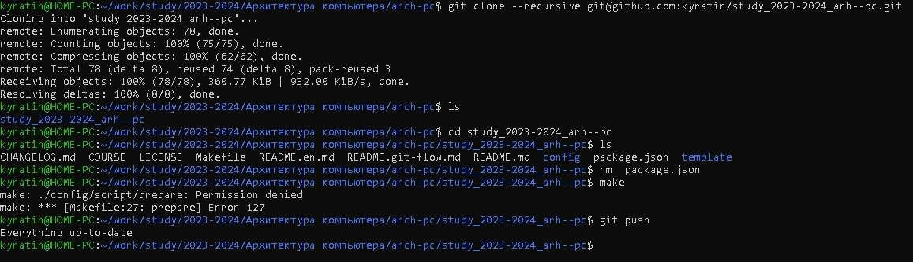
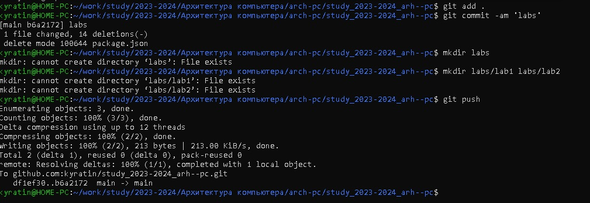

> **РОССИЙСКИЙ** **УНИВЕРСИТЕТ** **ДРУЖБЫ** **НАРОДОВ**
>
> **Факультет** **физико-математических** **и** **естественных**
> **наук**
>
> **Кафедра** **прикладной** **информатики** **и** **теории**
> **вероятностей**
>
> **ОТЧЕТ**
>
> **ПО** **ЛАБОРАТОРНОЙ** **РАБОТЕ** **№** **[2]{.underline}**
>
> *[дисциплина: Архитектура компьютера]{.underline}*
>
> [Студент: Геллер М.А.]{.underline}
>
> Группа: НПМбд-02-21
>
> № ст. билета: 1032217834
>
> **МОСКВА**
>
> 2[023]{.underline} г.
>
> Содержание
>
> 1 Цель
> работы\...\...\...\...\...\...\...\...\...\...\...\...\...\...\...\...\...\...\...\...\...\...\...\...\...\...\...\...\...\...\...\...\...\...\...\...\...\...\...\...\...\...\...\...\...\...\...\...\...\.....2
>
> 2
> Задание\...\...\...\...\...\...\...\...\...\...\...\...\...\...\...\...\...\...\...\...\...\...\...\...\...\...\...\...\...\...\...\...\...\...\...\...\...\...\...\...\...\...\...\...\...\...\...\...\...\...\...\...\...\...2
> 3 Теоретическое
> введение\...\...\...\...\...\...\...\...\...\...\...\...\...\...\...\...\...\...\...\...\...\...\...\...\...\...\...\...\...\...\...\...\...\...\...\...\...\...\...\...\...\....2
> 4 Выполнение лабораторной
> работы\...\...\...\...\...\...\...\...\...\...\...\...\...\...\...\...\...\...\...\...\...\...\...\...\...\...\...\...\...\...\...\...\...\.....3
> 5
> Выводы\...\...\...\...\...\...\...\...\...\...\...\...\...\...\...\...\...\...\...\...\...\...\...\...\...\...\...\...\...\...\...\...\...\...\...\...\...\...\...\...\...\...\...\...\...\...\...\...\...\...\...\...\...\...7
> Список
> литературы\...\...\...\...\...\...\...\...\...\...\...\...\...\...\...\...\...\...\...\...\...\...\...\...\...\...\...\...\...\...\...\...\...\...\...\...\...\...\...\...\...\...\...\...\...\...\...\.....8
>
> **1** **Цель** **работы**
>
> Целью работы является изучить применение средств контроля версий -
> git. Приобрести практические навыки по работе с системой контроля
> версий git.
>
> **2** **Задание**
>
> 1\. Создайте отчет по выполнению лабораторной работы в соответствующем
> каталоге рабочего пространства (labs\>lab02\>report).
>
> 2\. Скопируйте отчеты по выполнению предыдущих лабораторных работ в
> соответствующие каталоги созданного рабочего пространства.
>
> 3\. Загрузите файлы на github
>
> **3** **Теоретическое** **введение**
>
> Системы контроля версий (Version Control System, VCS) применяются при
> работе нескольких человек над одним проектом. Обычно основное дерево
> проекта хранится в локальном или удалённом репозитории, к которому
> настроен доступ для участников проекта. При внесении изменений в
> содержание проекта система контроля версий позволяет их фиксировать,
> совмещать изменения, произведённые разными участниками проекта,
> производить откат к любой более ранней версии проекта, если это
> требуется, в табл. 1 Основные команды git.
>
> *Table* *1:* *Описание* *некоторых* *команд* *git*
>
> Имя каталога
>
> /
>
> /bin

Описание каталога

Корневая директория, содержащая всю файловую

Основные системные утилиты, необходимые как в однопользовательском
режиме, так и при обычной работе всем пользователям

> Имя каталога
>
> /etc git init
>
> git pull
>
> git push
>
> git status
>
> git diff

Описание каталога

Общесистемные конфигурационные файлы и файлы конфигурации создание
основного дерева репозитория

получение обновлений (изменений) текущего дерева из центрального
репозитория

отправка всех произведённых изменений локального дерева в центральный
репозиторий

просмотр списка изменённых файлов в текущей директории

просмотр текущих изменения

> **4** **Выполнение** **лабораторной** **работы** Предварительная
> конфигурация git проводилась командами:
>
> git config \--global user.name
>
> git config \--global user.email
>
> Здесь указываются имя и email владельца репозитория
>
> Настройка utf-8 в выводе сообщений git:
>
> git config \--global core.quotepath false
>
> Задаётся имя начальной ветки (master):
>
> git config \--global init.defaultBranch master
>
> Параметр autocrlf:
>
> git config \--global core.autocrlf input
>
> Параметр safecrlf:
>
> git config \--global core.safecrlf warn
>
> Описываются проведённые действия, в качестве иллюстрации даётся ссылка
> на иллюстрацию (рис. \@fig:001).(рис. 4.1).

{width="6.71780949256343in"
height="1.8297255030621173in"}{width="6.750271216097988in"
height="2.029148075240595in"}

> *Рис.* *4.1.* *Предварительная* *конфигурация* *git*
>
> Для последующей идентификации пользователя на сервере репозиториев
> генерируем пару ключей (приватный и открытый) (рис. \@fig:002).(рис.
> 4.2).
>
> *Рис.* *4.2.* *Создание* *SSH* *ключа*
>
> Ключи сохраняться в каталоге \~/.ssh/. Далее загружаем сгенерённый
> открытый ключ. Для этого на сайте http: //github.org/ под своей
> учётной записью и в меню Setting выбрать в боковом меню SSH and GPG
> keys и нажать кнопку New SSH key . Скопировав из локальной консоли
> ключ в буфер обмена
>
> cat \~/.ssh/id_rsa.pub \| xclip -sel clip
>
> Создаём каталог для предмета «Архитектура компьютера» (рис.4.3.)

{width="8.204517716535433in"
height="2.774827209098863in"}

> *Рис.* *4.3.* *Создание* *каталог* *для* *предмета* *«Архитектура*
> *компьютера»* В каталоге курса:
>
> cd \~/work/study/2023-2024/\"Архитектура компьютера\"/arch-pc И создае
> м необходимые каталоги:
>
> {width="7.705687882764654in"
> height="2.495162948381452in"}echo arch-pc \> COURSE make
>
> *Рис.* *4.4.* *Создание* *каталог* *для* *предмета* *«Архитектура*
> *компьютера»* Добавляем фаи лы на сервер
> (коммит):{width="7.306185476815398in"
> height="2.527115048118985in"}
>
> Командои git add - добавляем все измене нные, созданные фаи лы или
> каталоги на сервер
>
> *Рис.* *4.5.* *Добавляем* *файлы* *на* *сервер* *(коммит)*
>
> Командои git push производим отправку всех произведенных изменении
> локального дерева в центральныи репозитории и проверяем результат
>
> Проверили правильность создания иерархии рабочего пространства в
> локальном репозитории и на странице github

**5** **Выводы**

В данной работе познакомились с системой контроля версий git. Создали
клон учебного репозитория создали и отредактировали файлы с последующей
отправкой в репозиторий и проверкой их наличия.

Визуальный интерфейс выглядит привлекательнее, но может и в командной
строке есть свои плюсы.

**Список** **литературы**

1\. GNU Bash Manual \[Электронный ресурс\]. Free Software Foundation,
2016. URL: https://www.gnu.org/software/bash/manual/.

2\. Newham C. Learning the bash Shell: Unix Shell Programming. O'Reilly
Media, 2005. 354 с.

3\. Zarrelli G. Mastering Bash. Packt Publishing, 2017. 502 с.

4\. Robbins A. Bash Pocket Reference. O'Reilly Media, 2016. 156 с.

5\. Таненбаум Э. Архитектура компьютера. 6-е изд. СПб.: Питер, 2013. 874
с.

6\. Таненбаум Э., Бос Х. Современные операционные системы. 4-е изд.
СПб.: Питер, 2015. 1120 с.
