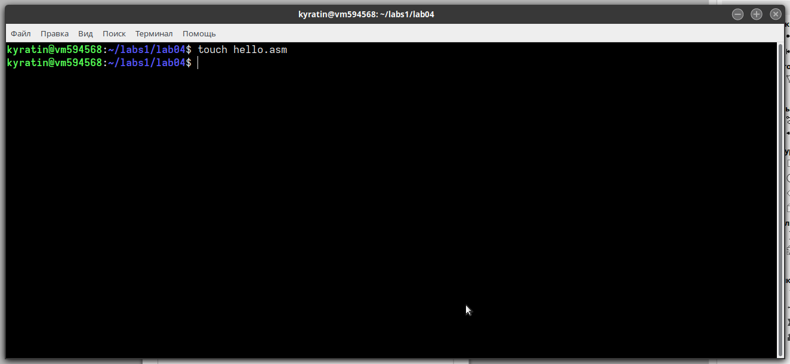
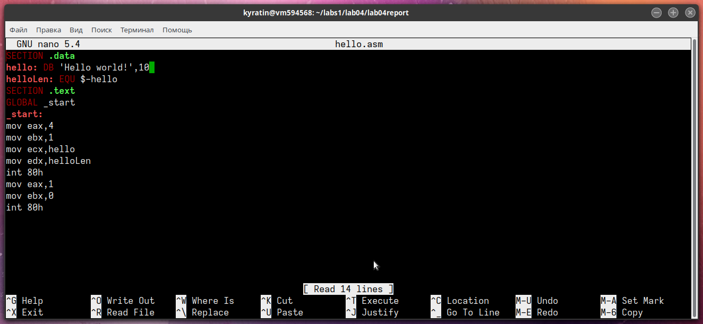
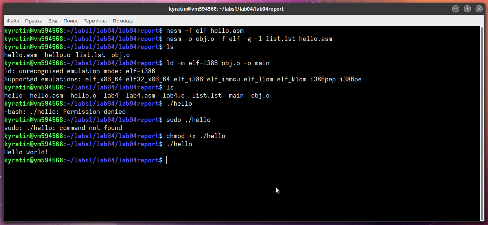
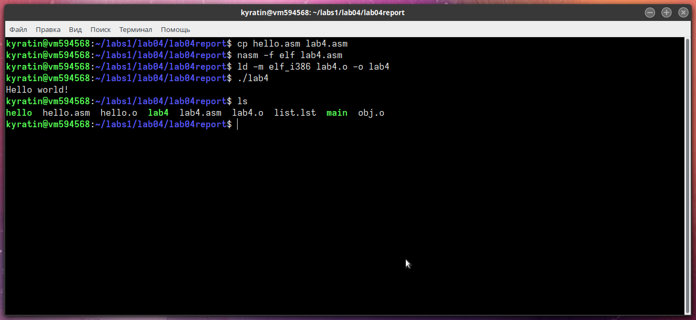
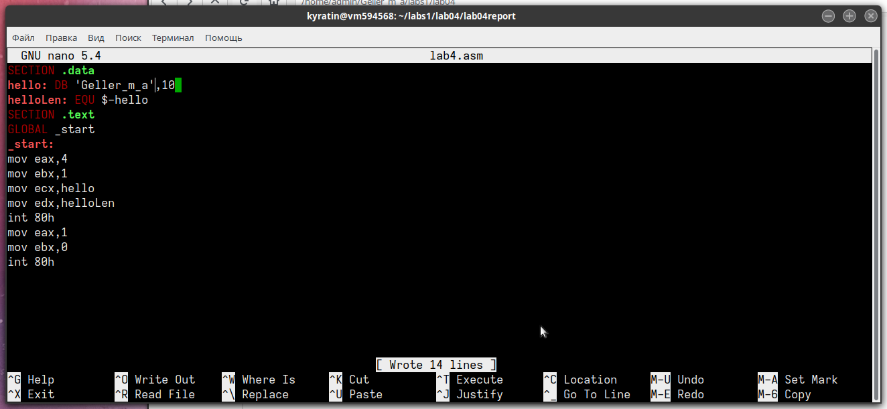

---
## Front matter
title: "–û—Ç—á—ë—Ç–∞ –ø–æ –ª–∞–±–æ—Ä–∞—Ç–æ—Ä–Ω–æ–π —Ä–∞–±–æ—Ç–µ 4"
subtitle: "–°–æ–∑–¥–∞–Ω–∏–µ –∏ –ø—Ä–æ—Ü–µ—Å—Å –æ–±—Ä–∞–±–æ—Ç–∫–∏ –ø—Ä–æ–≥—Ä–∞–º–º –Ω–∞ —è–∑—ã–∫–µ –∞—Å—Å–µ–º–±–ª–µ—Ä–∞ NASM"
author: "–û—Å—Ç–∞–Ω–∏–Ω –í–ª–∞–¥–∏—Å–ª–∞–≤ –ê–ª–µ–∫—Å–∞–Ω–¥—Ä–æ–≤–∏—á	–ù–ü–ú–±–≤-01-21"

## Generic otions
lang: ru-RU
toc-title: "–°–æ–¥–µ—Ä–∂–∞–Ω–∏–µ"

## Bibliography
bibliography: bib/cite.bib
csl: pandoc/csl/gost-r-7-0-5-2008-numeric.csl

## Pdf output format
toc: true # Table of contents
toc-depth: 2
lof: true # List of figures
lot: true # List of tables
fontsize: 12pt
linestretch: 1.5
papersize: a4
documentclass: scrreprt
## I18n polyglossia
polyglossia-lang:
  name: russian
  options:
	- spelling=modern
	- babelshorthands=true
polyglossia-otherlangs:
  name: english
## I18n babel
babel-lang: russian
babel-otherlangs: english
## Fonts
mainfont: PT Serif
romanfont: PT Serif
sansfont: PT Sans
monofont: PT Mono
mainfontoptions: Ligatures=TeX
romanfontoptions: Ligatures=TeX
sansfontoptions: Ligatures=TeX,Scale=MatchLowercase
monofontoptions: Scale=MatchLowercase,Scale=0.9
## Biblatex
biblatex: true
biblio-style: "gost-numeric"
biblatexoptions:
  - parentracker=true
  - backend=biber
  - hyperref=auto
  - language=auto
  - autolang=other*
  - citestyle=gost-numeric
## Pandoc-crossref LaTeX customization
figureTitle: "– –∏—Å."
tableTitle: "–¢–∞–±–ª–∏—Ü–∞"
listingTitle: "–õ–∏—Å—Ç–∏–Ω–≥"
lofTitle: "–°–ø–∏—Å–æ–∫ –∏–ª–ª—é—Å—Ç—Ä–∞—Ü–∏–π"
lotTitle: "–°–ø–∏—Å–æ–∫ —Ç–∞–±–ª–∏—Ü"
lolTitle: "–õ–∏—Å—Ç–∏–Ω–≥–∏"
## Misc options
indent: true
header-includes:
  - \usepackage{indentfirst}
  - \usepackage{float} # keep figures where there are in the text
  - \floatplacement{figure}{H} # keep figures where there are in the text
---

# –¶–µ–ª—å —Ä–∞–±–æ—Ç—ã

–¶–µ–ª—å—é —Ä–∞–±–æ—Ç—ã —è–≤–ª—è–µ—Ç—Å—è –æ—Å–≤–æ–µ–Ω–∏–µ –ø—Ä–æ—Ü–µ–¥—É—Ä—ã –∫–æ–º–ø–∏–ª—è—Ü–∏–∏ –∏ —Å–±–æ—Ä–∫–∏ –ø—Ä–æ–≥—Ä–∞–º–º, –Ω–∞–ø–∏—Å–∞–Ω–Ω—ã—Ö –Ω–∞ –∞—Å—Å–µ–º–±–ª–µ—Ä–µ NASM.

# –í—ã–ø–æ–ª–Ω–µ–Ω–∏–µ –ª–∞–±–æ—Ä–∞—Ç–æ—Ä–Ω–æ–π —Ä–∞–±–æ—Ç—ã

1. –°–æ–∑–¥–∞–ª–∏ –∫–∞—Ç–∞–ª–æ–≥ lab04 –∫–æ–º–∞–Ω–¥–æ–π mkdir, –ø–µ—Ä–µ—à–µ–ª –≤ –Ω–µ–≥–æ —Å –ø–æ–º–æ—â—å—é –∫–æ–º–∞–Ω–¥—ã cd, —Å–æ–∑–¥–∞–ª —Ñ–∞–π–ª hello.asm.

{ #fig:001 width=70%, height=70% }

2. –û—Ç–∫—Ä—ã–ª–∏ —Ñ–∞–π–ª –∏ –Ω–∞–ø–∏—Å–∞–ª–∏ —Ç–µ–∫—Å—Ç –ø—Ä–æ–≥—Ä–∞–º–º—ã

{ #fig:002 width=70%, height=70% }

```
SECTION .data
hello: DB 'Hello world!',10 
helloLen: EQU $-hello
SECTION .text
GLOBAL _start
_start:
mov eax,4
mov ebx,1
mov ecx,hello
mov edx,helloLen
int 80h
mov eax,1
mov ebx,0
int 80h
```
3. –¢—Ä–∞–Ω—Å–ª–∏—Ä–æ–≤–∞–ª–∏ —Ñ–∞–π–ª –∫–æ–º–∞–Ω–¥–æ–π nasm. –ü–æ–ª—É—á–∏–ª—Å—è –æ–±—ä–µ–∫—Ç–Ω—ã–π —Ñ–∞–π–ª hello.o

4. –¢—Ä–∞–Ω—Å–ª–∏—Ä–æ–≤–∞–ª–∏ —Ñ–∞–π–ª –∫–æ–º–∞–Ω–¥–æ–π nasm —Å –¥–æ–ø–æ–ª–Ω–∏—Ç–µ–ª—å–Ω—ã–º–∏ –æ–ø—Ü–∏—è–º–∏.

5. –í—ã–ø–æ–ª–Ω–∏–ª–∏ –ª–∏–Ω–∫–æ–≤–∫—É –∫–æ–º–∞–Ω–¥–æ–π ld –∏ –ø–æ–ª—É—á–∏–ª–∏ –∏—Å–ø–æ–ª–Ω—è–µ–º—ã–π —Ñ–∞–π–ª.

6. –ï—â–µ —Ä–∞–∑ –≤—ã–ø–æ–ª–Ω–∏–ª–∏ –ª–∏–Ω–∫–æ–≤–∫—É –¥–ª—è –æ–±—ä–µ–∫—Ç–Ω–æ–≥–æ —Ñ–∞–π–ª–∞ obj.o –∏ –ø–æ–ª—É—á–∏–ª–∏ –∏—Å–ø–æ–ª–Ω—è–µ–º—ã–π —Ñ–∞–π–ª main.

7. –ó–∞–ø—É—Å—Ç–∏–ª–∏ –∏—Å–ø–æ–ª–Ω—è–µ–º—ã–µ —Ñ–∞–π–ª—ã.

{ #fig:003 width=70%, height=70% }

8. –ò–∑–º–µ–Ω–∏–ª–∏ —Å–æ–æ–±—â–µ–Ω–∏–µ Hello world –Ω–∞ —Å–≤–æ–µ –∏–º—è –∏ –∑–∞–ø—É—Å—Ç–∏–ª–∏ —Ñ–∞–π–ª –µ—â–µ —Ä–∞–∑.

{ #fig:004 width=70%, height=70% }

```
SECTION .data
hello: DB 'Yusuf Subanov',10 
helloLen: EQU $-hello
SECTION .text
GLOBAL _start
_start:
mov eax,4
mov ebx,1
mov ecx,hello
mov edx,helloLen
int 80h
mov eax,1
mov ebx,0
int 80h
```

{ #fig:005 width=70%, height=70% }

# –í—ã–≤–æ–¥—ã

–û—Å–≤–æ–∏–ª–∏ –ø—Ä–æ—Ü–µ—Å—Å –∫–æ–º–ø–∏–ª—è—Ü–∏–∏ –∏ —Å–±–æ—Ä–∫–∏ –ø—Ä–æ–≥—Ä–∞–º–º, –Ω–∞–ø–∏—Å–∞–Ω–Ω—ã—Ö –Ω–∞ –∞—Å—Å–µ–º–±–ª–µ—Ä–µ nasm.
